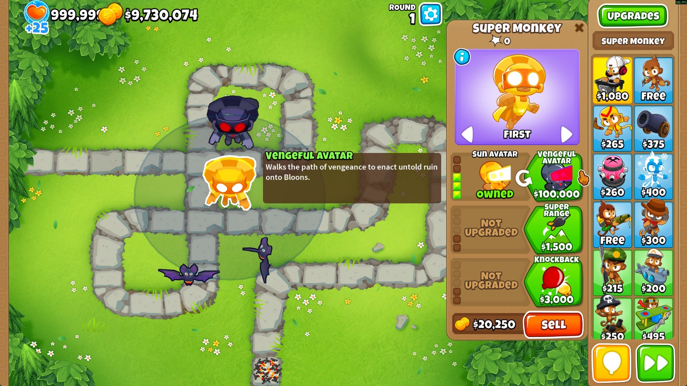
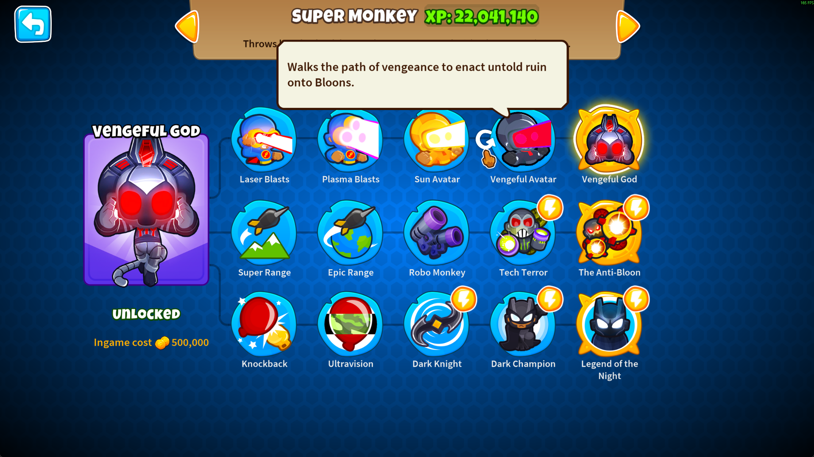
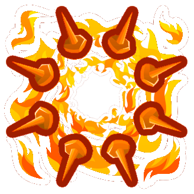
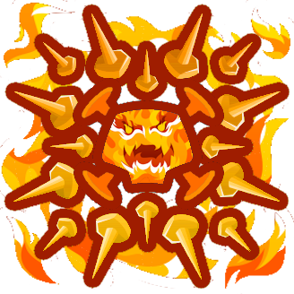
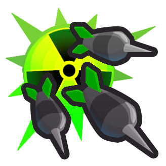
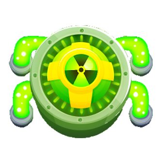
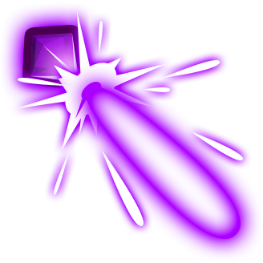
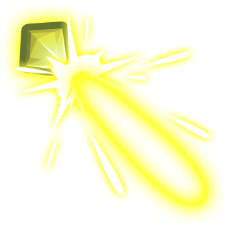
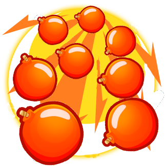
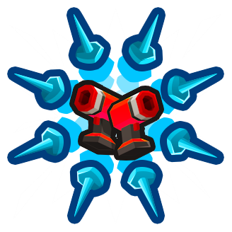

<h1 align="center">

Mirror Universe Paths
</h1>

Adds a number of alternate tower path branches using [PathsPlusPlus](https://github.com/doombubbles/paths-plus-plus).

Many paths are inspired by features of tier 3 towers that get overlooked/overwritten by the tier 4 and 5 upgrades in their path, but now have a new chance to shine with reimagined upgrades.

# Mod Additions

<!--Start-->

## Tack Shooter

### Fiery Tacks Top Path

Continues shooting tacks instead of replacing them with the ring of fire. Branches after Hot Shots.

#### 4. Superheated Tacks ($3,500)

Shoots superheated tacks that deal immense damage with slightly more pierce.

Tacks damage is increase to 5, and they have +2 pierce and +2 radius.

#### 5. Complete Combustion ($45,000)

Impossibly hot tacks roast Bloons with blazing efficiency.

Same meteor attack as base 5xx. Tack damage increased to 8 with +4 to MOABs, ranged increased by 11.5, pierce increased by 2x then +3, attack speed is tripled.

## Sniper Monkey

### MOAB DPS Top Path

Focuses on pure MOAB damage rather than stall/support. Branches after Deadly Precision.

#### 4. Assault MOAB ($6,300)

Deadly Precision's +50 Ceramic damage bonus now also applies to MOAB-class Bloons.

#### 5. Execute MOAB ($32,000)

Deals 10x damage to MOAB-class Bloons that are below 25% health.

## Monkey Sub

### Non-Submerge Top Path

Uses radioactive power for extra damage without submerging. Branches after Advanced Intel.

#### 3. Periscope Targeting ($700)

Allows Monkey Sub to detect and deal extra damage to Camo Bloons.

Grants camo detection, all projectiles deal bonus camo damage equal to their base damage.

#### 4. Bloontonium Darts ($2,400)

Darts do more damage and leave behind radioactive fallout that irradiates Bloons. Twin Guns makes radiation damage faster, Barbed Darts makes it last longer.

Dart damage increased to 2 like base 4xx, creates Fallout projectiles on first hitting a Bloon that have the same pierce, damage, and damage interval as the base 4xx attack. Lifespan is 2s, or 5s with Barbed Darts.

#### 5. RBMK Fallout ($28,000)

Radioactive Bloontonium Molecular Killzone. Darts and radiation tear apart Bloons at an atomic level, inflicting far more than 3.6 Roentgen.

Dart damage increased to 5 like base 5xx, Fallout projectiles are 33% larger, and have the same pierce, damage and damage interval as the base 5xx attack.

## Dartling Gunner

### Cannon Top Path

Continues shooting upgraded laser projectiles rather than switching to solid beams. Branches after Laser Cannon.

#### 4. Plasma Cannon ($10,000)

Upgrades to Plasma beams which have extra pierce and even more bonus MOAB damage. Can pop Lead Bloons.

Pierce increased by 5x, projectile scaled 1.25x, can pop leads, bonus MOAB damage increased to +10, laser shock lifespan to 5s

#### 5. Sun Cannon ($50,000)

Now shoots 3 beams at once of pure solar energy, with massive pierce and damage.

Shoots 3 projectiles at a time, pierce increased a further 10x, scale now 1.5x total, damage is 30 total with no MOAB bonus, shock life span 30s dealing 20 damage per tick.

## Super Monkey

### Non-Temple Top Path

Doesn't become a Temple or enact sacrifices. Branches after Sun Avatar.

#### 4. Sun Demigod ($50,000)

Ascends further along the path of solar divinity.

Attack speed is halved, shoots 3 Sun Temple projectiles at 80% scale that have 5 damage and 20 pierce, range increased by +15.

#### 5. Sun God ($100,000)

Tremble before the AWESOME power of the Sun God!! *trueness not guaranteed*

Attack speed is doubled, shoots 5 True Sun God projectiles at 80% scale that have 15 damage and 20 pierce.

### Vengeful Non-Temple Top Path

Doesn't become a Temple or enact sacrifices, but is vengeful about it. Branches after Sun Avatar.

#### 4. Vengeful Avatar ($100,000)

Walks the path of vengeance to enact untold ruin onto Bloons.

Projectile damage increased to 13, can hit Purple Bloons, range increased by +15

#### 5. Vengeful God ($500,000)

There can be only one.

Attack speed is doubled, shoots 5 Vengeful True Sun God projectiles at 80% scale that have 30 damage and 30 pierce, range increased by +15.

## Ninja Monkey

### Bomb Bottom Path

Amplifies Flash Bombs instead of getting Sticky Bombs. Branches after Flash Bomb.

#### 4. Boomjitsu ($5,000)

All shurikens are now replaced with flash bombs which deal bonus damage to MOAB-Class Bloons. Caltrops explode too.

Flash bombs are every attack instead of every 4th. Flash bombs deal +4 damage to MOABs. Caltrops create a flash bomb explosion on exhaust.

#### 5. Grand-Blaster Ninja ($40,000)

Explosions now stun MOAB-class Bloons and deal way more damage.

Applies the base xx5 effects of flash bombs stunning MOABs for .325s, flash bombs having 10 base damage, and caltrops having 5 base damage with +5 to ceramic. Flash bomb bonus MOAB damage is now +19.

## Engineer Monkey

### Nail Gun Bottom Path

Empowers Nail attacks instead of using Traps. Branches after Double Gun.

#### 4. Galvanized Nails ($3,600)

Nails deal significantly increased damage, can pop all Bloon types, and give increased cash per pop.

Nail damage increased by +2, pops all Bloon types, cash per pop is 2x, Deconstruction damage bonus increased by 4

#### 5. Nailstorm ($45,000)

Unleashes bucket loads of nails at super speed!

Shoots 3 nails at a time in a 30° cone, attack speed increased 3x, nail pierce increased by 2x, cash per pop now 3x

<!--End-->

